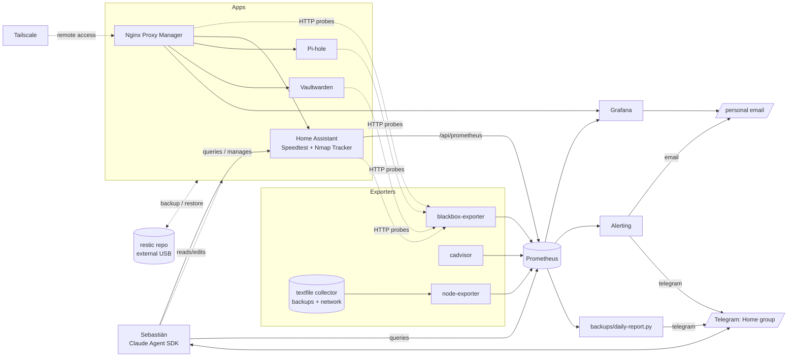

# 🏠 home

[🇪🇸 Español](README.md) · 🇬🇧 English

> Infrastructure for a home homelab (Dell Optiplex), managed 100% as code: `docker-compose.yaml` + version-controlled configuration, with monitoring, alerting, and automated backups and restore.


-33b1e0)


---

## Contents

- [Services](#services-docker-composeyaml)
- [Architecture](#architecture)
- [Monitoring and alerting](#monitoring-and-alerting)
- [Backups and restore](#backups-and-restore-backups)
- [Sebastián: conversational agent](#sebastián-conversational-agent-telegram-agent)
- [Repository structure](#repository-structure)
- [Getting started](#getting-started)
- [Security and secrets](#security-and-secrets)
- [Notes](#notes)

---

## Services (`docker-compose.yaml`)

| Service | Description |
|---|---|
| `homeassistant` | Home automation. `network_mode: host`, uses a Zigbee USB dongle. |
| `pihole` | DNS + adblock for the whole network. |
| `vaultwarden` | Self-hosted Bitwarden server. |
| `nginx-proxy-manager` | Reverse proxy and Let's Encrypt certificate management. |
| `node-exporter` | Host metrics for Prometheus. |
| `cadvisor` | Docker container metrics. |
| `prometheus` | Stores the metrics (730-day retention). |
| `grafana` | Dashboards, at `https://grafana.kikeramirez.org`. |
| `blackbox-exporter` | HTTP/ICMP availability probes. |
| `tailscale` | Mesh VPN / remote access, advertises the route to the LAN. |

Internet connection speed (Speedtest.net) and devices connected to the LAN
(Nmap Tracker) are collected in Home Assistant, not in a separate exporter:
Prometheus scrapes them directly via HA's `/api/prometheus` (see below).

## Architecture



## Monitoring and alerting

- **Grafana** (`grafana/provisioning/`): 6 dashboards (Home, Homelab Overview,
  Network, Containers, System (detail), Backups), sober and consistent
  style, all cross-linked.
- **Prometheus** (`prometheus/prometheus.yml`): scrapes node-exporter,
  cAdvisor, blackbox-exporter (ICMP + HTTP), Home Assistant (Speedtest +
  Nmap Tracker, via `/api/prometheus` with a token in `prometheus/ha-token.txt`,
  not version-controlled), and itself/Grafana. 730-day retention.
- **Alerting** (`grafana/provisioning/alerting/rules.yaml`): disk full,
  any target down, containers in a crash-loop or stopped, backup overdue,
  Pi-hole/Vaultwarden/NPM/Home Assistant/webhook-server unreachable, restic
  integrity check overdue. Notifies by email as soon as it fires.
- **`backups/daily-report.py`**: daily email (08:00) with the homelab's
  overall status — if there are problems it lists them with a hint to fix
  them, otherwise a summary with the most important metrics. Problems are
  derived by evaluating the rules in
  `grafana/provisioning/alerting/rules.yaml` directly against Prometheus
  (the single source of truth for thresholds, never duplicated). Requires
  `python3-yaml`.

## Backups and restore (`backups/`)

| Script | What it does |
|---|---|
| `backup.sh` | Nightly backup (cron 03:30): app data + config. Rotation: 7 daily / 4 weekly / 6 monthly. |
| `backup-monthly.sh` | Full monthly system backup (day 1, 00:00), **kept forever** (`monthly-full`). Also includes `docker-compose.yaml`, `.env`, Prometheus/Blackbox config, Tailscale state, and the Grafana DB. |
| `backup-offsite.sh` | Offsite copy (Google Drive via rclone, day 1 01:30, after `backup-monthly.sh`) of the `monthly-full` snapshots to a second, independent restic repo — covers total loss of the local USB drive (3-2-1). Uses `restic` natively on the host (not the container), since it needs the rclone backend. |
| `restic-check.sh` | Integrity check (cron day 15, 02:00): local repo with `--read-data-subset=10%` (cycles through the whole repo over ~10 months), offsite repo only structure/indexes (no packs downloaded, to avoid burning through the Drive API quota). Metric + Grafana alert if either repo goes >40 days without a successful check. |
| `logrotate.conf` | Installed at `/etc/logrotate.d/homelab` (not via its own cron). Rotates `backups/*.log` + `telegram-agent/agent.log`: weekly, 8-week history, compressed. |
| `restore.sh` | Restores a full snapshot onto the live system. Before touching anything it creates a `pre-restore` safety snapshot, stops the whole stack (avoids corrupting SQLite mid-write), restores, and brings it back up. |
| `webhook-server.py` | Minimal HTTP server (stdlib only, on the host, managed as the `webhook-server.service` systemd unit) that exposes `backup-now`, `restore` (confirmation), and `restore-confirm` (execution) as buttons on the "Backups" dashboard. Protected by a shared token, only reachable from the LAN/Tailscale. |
| `container-health-metrics.sh` | `HEALTHCHECK` status of every container → textfile collector (cron every minute). |
| `network-metrics.sh` | Pi-hole metrics (summary + devices) → textfile collector. |
| `backup-common.sh` | Shared helpers (locking, logging, metrics, `.env` reading) used by the backup/restore scripts. |
| `docker-prune.sh` | Weekly `docker system prune -f` (Sundays 04:00): stopped containers, orphaned networks, dangling images, and build cache. Doesn't touch tagged images in use or volumes. |

The `restic` repository (encrypted, deduplicated) is stored on an external
USB drive mounted at `/media/home/home-backups`, with the password in
`backups/restic-password.txt` (not version-controlled).

The drive is mounted via `/etc/fstab` (entry by `UUID`, not by device path
like `/dev/sdb1` — the device name can change depending on the USB port
used, the UUID doesn't), with `nofail` so a missing drive never blocks boot.
**Don't rely on desktop automount (udisks/gvfs)**: it only mounts the drive
when there's an active user session, so a cron job at 03:30 (no graphical
session) can find the drive unmounted — that's exactly what happened after
moving the drive to a different USB port, which forced a reboot and the
automount never kicked in. Every script checks
`mountpoint -q /media/home/home-backups` and aborts if it's not mounted, so
a mount failure shows up in the log/alert instead of corrupting anything —
but it's better to avoid the failure at the root with the `fstab` entry.
Example line (swap in the UUID from `lsblk -o NAME,UUID,LABEL`):

```
UUID=<drive-uuid> /media/home/home-backups ntfs3 defaults,nofail,uid=1000,gid=1000,umask=002,x-systemd.device-timeout=10 0 0
```

> ⚠️ **Restoring a backup overwrites production data.** The dashboard
> requires explicit confirmation and always leaves a `pre-restore` snapshot
> before applying anything.

## Sebastián: conversational agent (`telegram-agent/`)

Python daemon (Claude Agent SDK) that runs on the host as a systemd service
(`sebastian-bot.service`) and talks over Telegram in a group shared by the
people in the house. Lets anyone ask about the homelab/Home Assistant and
act on it with real tools:

| Piece | What it does |
|---|---|
| `agent.py` | The daemon: a single conversation session (one per group, not per person — it tells people apart by their Telegram sender name), ✅/❌ confirmation buttons for actions with real effects, a "typing..." indicator, safety Markdown→HTML conversion. |
| `tools.py` | Custom MCP tools: `ha_get_states`/`ha_list_services`/`ha_call_service` (Home Assistant), `prometheus_query`, `docker_restart` (allow-listed services), `git_commit`. Plus the native Read/Grep/Glob/Edit/WebSearch/Bash. |
| `memory.md` | Long-term memory notebook, shared by everyone, editable by Sebastián himself without asking for confirmation (low risk). Backed up every night along with the rest of the app data. |
| `session_id.txt` | Agent SDK session id, to resume the conversation if the daemon restarts. Not backed up (low value). |
| `sebastian-bot.service` | systemd unit (`Restart=on-failure`) — installed under `/etc/systemd/system/`, starts on its own on every boot. |

**Permissions**: read-only tools and edits to `memory.md` run directly; the
rest (calling an HA service, restarting a container, committing, editing
any other file, Bash that isn't clearly read-only) is proposed over
Telegram and waits for confirmation.

**Authentication**: reuses the `claude` CLI's already-logged-in session on
the machine — it doesn't need its own `ANTHROPIC_API_KEY` and doesn't
depend on a Claude Code session being open anywhere.

## Repository structure

```text
docker-compose.yaml       # Definition of every service
.env                       # Secrets (NOT version-controlled, see .env.example)
backups/                   # Backup/restore scripts + custom metrics
grafana/provisioning/      # Grafana datasources, dashboards, and alerting
prometheus/prometheus.yml  # Scrape configuration
blackbox/config.yml        # blackbox-exporter probe modules
homeassistant/config/      # Home Assistant configuration (partial, see below)
telegram-agent/            # Sebastián: conversational agent over Telegram
docs/                      # Step-by-step guides (setup from scratch, restore on new hardware)
pihole/, vaultwarden/, nginx-proxy-manager/, tailscale/
                            # Runtime data bind mounts for each service
                            # (databases, certificates, state -> gitignored)
```

## Getting started

- **Fresh install, no prior backup**: follow
  [`docs/SETUP-DESDE-CERO.en.md`](docs/SETUP-DESDE-CERO.en.md) — step by
  step from cloning the repo to Sebastián answering on Telegram.
- **Recover an existing system on new hardware (broken disk,
  migration)**: follow
  [`docs/RESTAURAR-DESDE-BACKUP.en.md`](docs/RESTAURAR-DESDE-BACKUP.en.md) —
  restores from the last monthly backup on the USB drive instead of setting
  everything up from scratch.

## Security and secrets

None of the following is version-controlled (see `.gitignore`):

- `.env` and any `*.env` (SMTP, tokens, Pi-hole/Vaultwarden/Tailscale passwords).
- `backups/restic-password.txt` (encryption key for the backups repository).
- `prometheus/ha-token.txt` (Home Assistant long-lived token, used by
  Prometheus to read `/api/prometheus` and by Sebastián's tools to talk to
  the HA API).
- Runtime data with sensitive content: `vaultwarden/data/`, `pihole/etc-pihole/`,
  `nginx-proxy-manager/{data,letsencrypt}/`, `tailscale/state/`, and the
  databases/state/`secrets.yaml` under `homeassistant/config/`.
- Logs, locks, and runtime-generated metrics (`backups/*.log`, `backups/*.lock`,
  `backups/metrics/`, `telegram-agent/*.log`).
- Sebastián's runtime state: `telegram-agent/.venv/`, `telegram-agent/memory.md`
  (not a secret, but dynamic state, not config), `telegram-agent/session_id.txt`.

Only "as-code" configuration is version-controlled (compose, Grafana/Prometheus
provisioning, scripts) — never credentials or databases.

## Notes

- Grafana dashboards and alerts live both in provisioned JSON
  (`grafana/provisioning/dashboards/`) and in the `grafana_data` volume
  (changes made from the UI); the monthly backup covers both.
- `home-launcher.json` is a "portal"-style dashboard linking to the
  homelab's services.
