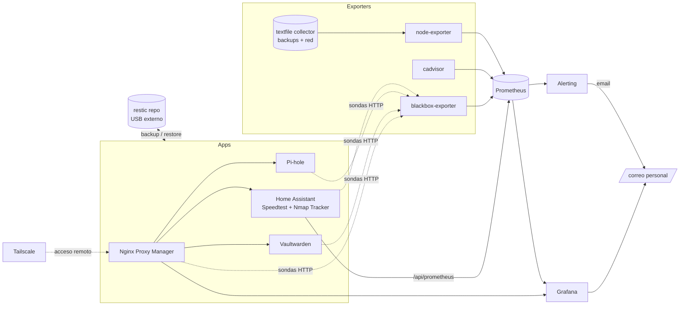

# 🏠 home

> Infraestructura de un homelab casero (Dell Optiplex), gestionada 100% como código: `docker-compose.yaml` + configuración versionada, con monitorización, alertado, backups y restore automatizados.


---

## Contenido

- [Servicios](#servicios-docker-composeyaml)
- [Arquitectura](#arquitectura)
- [Monitorización y alertado](#monitorización-y-alertado)
- [Backups y restore](#backups-y-restore-backups)
- [Estructura del repositorio](#estructura-del-repositorio)
- [Puesta en marcha](#puesta-en-marcha)
- [Seguridad y secretos](#seguridad-y-secretos)
- [Notas](#notas)

---

## Servicios (`docker-compose.yaml`)

| Servicio | Descripción |
|---|---|
| `homeassistant` | Domótica. `network_mode: host`, usa un dongle Zigbee USB. |
| `pihole` | DNS + adblock para toda la red. |
| `vaultwarden` | Servidor Bitwarden self-hosted. |
| `nginx-proxy-manager` | Proxy inverso y gestión de certificados Let's Encrypt. |
| `node-exporter` | Métricas del host para Prometheus. |
| `cadvisor` | Métricas de contenedores Docker. |
| `prometheus` | Almacena las métricas (retención 730 días). |
| `grafana` | Dashboards, en `https://grafana.kikeramirez.org`. |
| `blackbox-exporter` | Sondas de disponibilidad HTTP/ICMP. |
| `tailscale` | VPN mesh / acceso remoto, anuncia la ruta a la LAN. |

Velocidad de conexión (Speedtest.net) y dispositivos conectados a la LAN
(Nmap Tracker) se recopilan en Home Assistant, no en un exporter aparte:
Prometheus los recoge directamente vía `/api/prometheus` de HA (ver más
abajo).

## Arquitectura



## Monitorización y alertado

- **Grafana** (`grafana/provisioning/`): 6 dashboards (Home, Homelab Overview,
  Network, Contenedores, Sistema (detalle), Backups), estilo sobrio y
  consistente, todos enlazados entre sí.
- **Prometheus** (`prometheus/prometheus.yml`): scrapea node-exporter,
  cAdvisor, blackbox-exporter (ICMP + HTTP), Home Assistant (Speedtest +
  Nmap Tracker, vía `/api/prometheus` con token en `prometheus/ha-token.txt`,
  no versionado), y a sí mismo/Grafana. Retención de 730 días.
- **Alerting** (`grafana/provisioning/alerting/rules.yaml`): disco lleno,
  cualquier target caído, contenedores en crash-loop o parados, backup
  atrasado, Pi-hole/Vaultwarden/NPM/Home Assistant inalcanzables. Notifica
  por email en cuanto se dispara.
- **`backups/daily-report.py`**: correo diario (08:00) con el estado
  general del homelab — si hay problemas los lista con una pista para
  resolverlos, si no, un resumen con las métricas más importantes.

## Backups y restore (`backups/`)

| Script | Qué hace |
|---|---|
| `backup.sh` | Backup nocturno (cron 03:30): datos de las apps + config. Rotación 7 diaria / 4 semanal / 6 mensual. |
| `backup-monthly.sh` | Backup mensual completo del sistema (día 1, 00:00), **conservado para siempre** (`monthly-full`). Incluye además `docker-compose.yaml`, `.env`, config. de Prometheus/Blackbox, estado de Tailscale y la BD de Grafana. |
| `restore.sh` | Restaura un snapshot completo sobre el sistema en vivo. Antes de tocar nada crea un snapshot de seguridad `pre-restore`, para todo el stack (evita corromper SQLite en caliente), restaura, y vuelve a levantarlo. |
| `webhook-server.py` | Servidor HTTP mínimo (stdlib only, en el host) que expone `backup-now`, `restore` (confirmación) y `restore-confirm` (ejecución) como botones del dashboard "Backups". Protegido por token compartido, solo accesible desde LAN/Tailscale. |
| `container-health-metrics.sh` | Estado de `HEALTHCHECK` de cada contenedor → textfile collector (cron cada minuto). |
| `network-metrics.sh` | Métricas de Pi-hole (resumen + dispositivos) → textfile collector. |
| `backup-common.sh` | Helpers compartidos (lock, logging, métricas) usados por los scripts de backup/restore. |

El repositorio de `restic` (cifrado, deduplicado) se guarda en un disco USB
externo montado en `/media/home/home-backups`, con la contraseña en
`backups/restic-password.txt` (no versionada).

> ⚠️ **Restaurar un backup sobrescribe datos en producción.** El dashboard
> pide confirmación explícita y siempre deja un snapshot `pre-restore` antes
> de aplicar nada.

## Estructura del repositorio

```text
docker-compose.yaml       # Definición de todos los servicios
.env                       # Secretos (NO versionado, ver .env.example)
backups/                   # Scripts de backup/restore + métricas custom
grafana/provisioning/      # Datasources, dashboards y alerting de Grafana
prometheus/prometheus.yml  # Configuración de scraping
blackbox/config.yml        # Módulos de sondeo de blackbox-exporter
homeassistant/config/      # Configuración de Home Assistant (parcial, ver abajo)
pihole/, vaultwarden/, nginx-proxy-manager/, tailscale/
                            # Bind mounts de datos runtime de cada servicio
                            # (bases de datos, certificados, estado -> ignorados)
```

## Puesta en marcha

1. Clona el repo en el host que va a correr los servicios.
2. Copia `.env.example` a `.env` y rellena los valores reales:
   ```bash
   cp .env.example .env
   ```
3. Levanta los servicios:
   ```bash
   docker compose up -d
   ```
4. Restaura desde backup lo que se excluyó del repo (bases de datos,
   certificados, estado de Tailscale, `.storage`/`.cloud` de Home
   Assistant) si vienes de una instalación existente — usa `backups/restore.sh`
   o vuelve a configurar cada servicio desde cero si es una instalación nueva.
5. Configura los crons de `backups/` (`backup.sh`, `backup-monthly.sh`,
   `container-health-metrics.sh`, `network-metrics.sh`, `daily-report.py`)
   según los horarios indicados en la cabecera de cada script.

## Seguridad y secretos

Nada de lo siguiente se versiona (ver `.gitignore`):

- `.env` y cualquier `*.env` (SMTP, tokens, contraseñas de Pi-hole/Vaultwarden/Tailscale).
- `backups/restic-password.txt` (clave de cifrado del repositorio de backups).
- `prometheus/ha-token.txt` (token de larga duración de Home Assistant que usa
  Prometheus para leer `/api/prometheus`).
- Datos runtime con contenido sensible: `vaultwarden/data/`, `pihole/etc-pihole/`,
  `nginx-proxy-manager/{data,letsencrypt}/`, `tailscale/state/`, y las bases de
  datos/estado/`secrets.yaml` de `homeassistant/config/`.
- Logs, locks y métricas generadas en runtime (`backups/*.log`, `backups/*.lock`,
  `backups/metrics/`).

Solo se versiona la configuración "de código" (compose, provisioning de
Grafana/Prometheus, scripts) — nunca credenciales ni bases de datos.

## Notas

- Dashboards y alertas de Grafana viven tanto en JSON provisionado
  (`grafana/provisioning/dashboards/`) como en el volumen `grafana_data`
  (cambios hechos desde la UI); el backup mensual cubre ambos.
- `home-launcher.json` es un dashboard tipo "portal" de acceso a los
  servicios del homelab.
